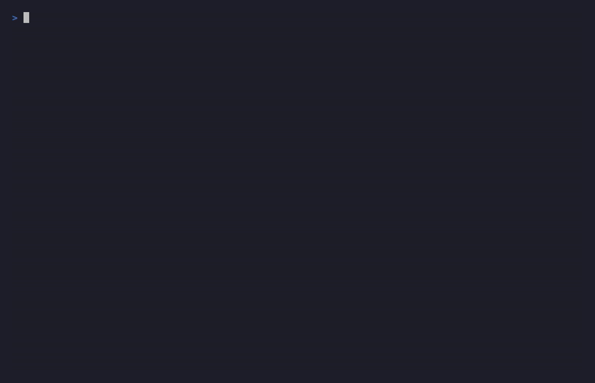

# RegressionLedger

[](https://github.com/anlor1002-alt/regressionledger/actions/workflows/ci.yml)
[](LICENSE)


[](CONTRIBUTING.md)
[](https://www.npmjs.com/package/regressionledger)
[](https://www.npmjs.com/package/regressionledger)

> **Stop your coding agent from resurrecting fixes that already failed.**

Coding agents (Claude Code, Cursor, …) lose their memory when the context window
fills up — and then confidently re-apply a patch they already tried two prompts,
or two sessions, ago. You watch the same wrong fix go in, the same test go red,
and your credits evaporate in the *fix-one-thing, break-it-again* doom loop.

RegressionLedger is a tiny, **zero-dependency** Claude Code hook + CLI that:

1. **fingerprints** every edit the agent makes (normalized so cosmetic
   differences don't matter, but `true` vs `false` still does),
2. **links** each edit to the outcome of the next test/build run (pass or fail),
3. **persists** that to a local ledger that survives session restarts *and*
   context compaction, and
4. **hard-blocks** the agent — via a `PreToolUse` deny — the moment it tries to
   re-apply a patch that previously failed, telling it *exactly why* and to
   change strategy.



```
⛔ BLOCKED before it could waste another test cycle:

   RegressionLedger: you already tried the same fix to src/auth.js 2 hours ago.
   It failed with: AssertionError: expected 200, got 401.
   Re-applying it will reproduce the same failure. Change strategy instead.
   Run `rl show src/auth.js` to see the full attempt history.
```

Try it right now, no agent required:

```bash
npx regressionledger        # (after publish) — or clone and run:
npm run demo
```

---

## Why this exists

The "AI fixes one bug and creates two" loop is one of the single most-reported
pains of working with coding agents. The failure has a specific shape:

- the agent's **memory of what it already tried doesn't survive** a long build or
  a context-window reset (*"This forces me to start a new Composer, losing all
  previous contexts."*);
- existing loop-detectors only notice **identical tool calls within one
  session** — they don't remember, across sessions, *which fix* was tried and
  *what it broke*;
- general agent-memory layers only **advise** ("here's a lesson learned"), and
  the model routinely ignores advice it's free to ignore.

RegressionLedger targets exactly that gap: a **cross-session, semantic,
outcome-linked** ledger of fix attempts, surfaced as a **hard block** rather than
a suggestion.

## How it works

```
            PreToolUse (Edit/Write/MultiEdit)
                        │
       fingerprint the proposed change
                        │
        any prior FAILED attempt ≥ threshold?
              │                       │
            yes                      no
              │                       │
   ┌──────────┴──────────┐         allow
   │ block: deny + reason │
   └──────────────────────┘

        PostToolUse (Edit/Write/MultiEdit)  ── record attempt as "pending"
        PostToolUse (Bash: npm test / pytest / …) ── resolve pending → pass | fail
```

- **Fingerprint** — the changed code is lexed into a normalized token stream:
  whitespace and comments are stripped; string and number literals collapse to
  `STR`/`NUM`; identifiers, keywords, and operators are kept. Two edits with the
  same structure but different messages/limits collide; `return true` and
  `return false` do **not**. A SHA-256 of the stream gives O(1) exact matching;
  k-gram Jaccard similarity catches near-duplicates.
- **Outcome linkage** — after the agent runs `npm test` / `pytest` / `tsc` /
  `cargo test` / …, the hook parses the output and marks the edits since the last
  run as `pass` or `fail`, capturing the first error line as a signature. When a
  fix finally **passes**, any stale matching `fail` records are retired so they
  never block again.
- **The ledger** — a plain JSON file at `.regressionledger/ledger.json`. No
  database, no native module, no API key, no network. It is the thing that
  survives compaction.

### Does the matching actually work?

Check it yourself in seconds — the benchmark is deterministic:

```bash
npm run bench
# Disguised repeat fixes caught : 120/120  (100.0%)
# False blocks on distinct fixes: 0/190    (0.0%)
```

120 cosmetically-disguised re-applications (reflowed whitespace, injected
comments, changed string/number literals) are all caught; 190 pairs of
genuinely different fixes produce zero false blocks at the default threshold.

## Install

Requires Node ≥ 18.

### As a Claude Code plugin (recommended)

```text
/plugin marketplace add anlor1002-alt/regressionledger
/plugin install regressionledger@anlor1002-plugins
```

The hooks activate automatically — no `settings.json` editing and no restart.

### As an npm package

```bash
# inside your project
npx regressionledger init      # or: npm i -g regressionledger && rl init
```

`init` will:

- write the `PreToolUse` / `PostToolUse` hooks into `./.claude/settings.json`
  (merging, not clobbering, any hooks you already have),
- create `.regressionledger/` with a default `config.json`,
- add `.regressionledger/ledger.json` to your `.gitignore`.

Then restart Claude Code (or run `/hooks`) so it picks up the new hooks. That's
it — RegressionLedger now works silently until a repeat failed fix shows up.

> Prefer to wire it by hand? `rl init --print` outputs the exact `hooks` block.

### LLM Quickstart

> **If you are a coding agent reading this:** you can install RegressionLedger
> for your human in one step. In Claude Code, run the slash commands
> `/plugin marketplace add anlor1002-alt/regressionledger` then
> `/plugin install regressionledger@anlor1002-plugins` — your PreToolUse/PostToolUse
> hooks activate automatically. Alternatively run `npx regressionledger init` in
> the project root, then verify with `npx regressionledger doctor` (all checks
> should pass; the live round-trips prove the guardrail works). The tool is
> local-only: no network calls, no API keys, fails open. It will block you from
> re-applying a fix that previously failed — that is the intended behavior, not
> an error. When blocked, change strategy instead of rephrasing the same patch;
> the human can run `rl unblock <file>` if the context genuinely changed.

## Usage

It runs itself. The commands you'll actually use:

| Command | What it does |
| --- | --- |
| `rl doctor` | Verify the install: env checks plus **live hook round-trips** (a first-time edit must pass, a seeded repeat failure must be denied). |
| `rl doctor --explain "<output>"` | Paste any test/build output and see exactly how it's classified — pass, fail, or "ambiguous, left pending" — and which toolchain pattern decided. |
| `rl why <file>` | Plain-language answer to "what have we tried here?": blocking failures with reasons, walls (same error across attempts), retirements with receipts, passes. |
| `rl show [file]` | The attempt history — failures, passes, error signatures, previews. The shareable artifact. |
| `rl show --by-error` | Cluster failures by error signature across files — exposes "you keep hitting the same wall from different angles". |
| `rl report [--html]` | A shareable report: markdown to stdout, or a self-contained dark-mode HTML file with attempt timelines, blocked-fix counts, and error clusters. |
| `rl stats [--card]` | Summary counts, plus how many repeat fixes were blocked (or would have been, in warn mode). `--card` prints a shareable screenshot card. |
| `rl list [--json]` | Flat list of every attempt. |
| `rl config` | View settings. `rl config mode warn`, `rl config threshold 0.85`, … |
| `rl unblock <file>` | Retire recorded failures for a file when the context genuinely changed — they stop blocking but stay auditable (∅ retired, with a receipt). |
| `rl clear --force` | Wipe the ledger. |

## Configuration

`.regressionledger/config.json` (safe to commit — share thresholds with your team):

| Key | Default | Meaning |
| --- | --- | --- |
| `mode` | `block` | `block` = hard-deny a repeat failed fix. `warn` = allow but inject a warning. |
| `threshold` | `0.9` | Similarity (0–1) at which two edits count as "the same fix". Higher = stricter. |
| `minFailures` | `1` | A fix must have failed at least this many times before it blocks. Set `2` for an extra-cautious rollout. |
| `crossSymbol` | `true` | Match a failed patch anywhere in the same file. Set `false` to also require the same enclosing symbol. |
| `maxLedger` | `5000` | Cap on stored attempts; oldest are dropped past this. |

Nervous about false positives on day one? Start with `rl init --warn`. Every
would-have-blocked event is logged, `rl stats` shows the count, and `rl show`
lets you audit each one against your own code — then flip to `block` with
evidence (`rl config mode block`). For an extra safety margin, require a fix to
fail twice before it ever blocks: `rl config minFailures 2`.

## How it's different

| Tool | Cross-session? | Outcome-linked? | Blocks (vs advises)? |
| --- | :---: | :---: | :---: |
| In-session loop detectors (identical tool-call hashing) | ✗ | ✗ | warns |
| General agent-memory ("lessons learned") | ✓ | ✗ | advises |
| Self-intervention research (Wink, …) | ✗ | partial | guides |
| **RegressionLedger** | **✓** | **✓** | **blocks** |

The differentiators: a **semantic** fix fingerprint (not raw-text or tool+arg
hashing), an **outcome** link (which fix failed, and why), **cross-session +
post-compaction** persistence, and a **hard block** that the model can't ignore.

## FAQ

**Will it block a legitimately different edit to the same function?**
No — matching is keyed on the *normalized changed code*, not the function. A
different approach to the same bug has a different fingerprint and sails through.

**What if the failed fix is actually correct and something else was broken?**
Once any run marks that exact fix as **passing**, the stale `fail` record is
retired and it stops blocking. You can also `rl clear --force` or use `warn` mode.

**Does it send my code anywhere?** No. Everything is local, deterministic, and
offline. The ledger stores normalized tokens and a short preview, never your
secrets-in-context.

**Cursor / Windsurf / other agents?** v1 ships for Claude Code's hook surface
(the one place this is installable today). The engine is harness-agnostic; other
integrations are on the roadmap.

## Roadmap

- AST-based fingerprints via tree-sitter (more precise symbol & structure
  matching) as an optional upgrade, keeping the zero-dep default.
- Adapters for other agent harnesses.
- `rl why <file>` — natural-language "what have we already tried here?" summary.

## Development

```bash
npm test        # node:test, zero dependencies
npm run demo    # the doom-loop simulation above
```

Contributions welcome — see [CONTRIBUTING.md](CONTRIBUTING.md). The canonical
first PR: **add support for your test runner** — one toolchain entry in
[`src/signatures.js`](src/signatures.js), a real output sample in
[`test/fixtures/`](test/fixtures), and a row in the table-driven
[`test/outcome-fixtures.test.js`](test/outcome-fixtures.test.js). Also good:
add a language to the tokenizer's comment map.

## License

[MIT](LICENSE)
